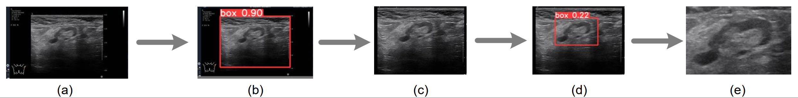

# Breast tumor detection from ultrasound images with YOLO
  
## 1. Introduction

This repo is for those who want to detect tumor from breast ultrasound images (in DICOM format) with YOLO. 

      
    <em> 
    Figure 1. Examples of the cropping process. (a) An image with surrounding metadata before cropping. (b) and (c) shows the detection of ultrasound image. (d) and (e) illustrate the detection of breast tumor. 
    </em>

## 2. Getting Started

- ### Installation
    Install PyTorch and other dependencies. Download the weights ([link](https://drive.google.com/drive/folders/1cKKfW3cFnmxDd5ExDCU8iMe2pYXMjD8W?usp=drive_link)). The weights should be saved in `./yolo/yolo_weight/`.

- ### Dataset Preparation
    Put all DICOM files in `./data/`. We also provide two DICOM files as examples.

- ### Crop tumor from DICOM file
    Run `./crop_tumor.py` to crop tumor from DICOM file. You can adjust the hyperparameters in `./yolo/inference.py`. The results will be saved in `./cropped/`.

## 3. References
- YOLO V5: [[HERE]](https://github.com/ultralytics/yolov5)
